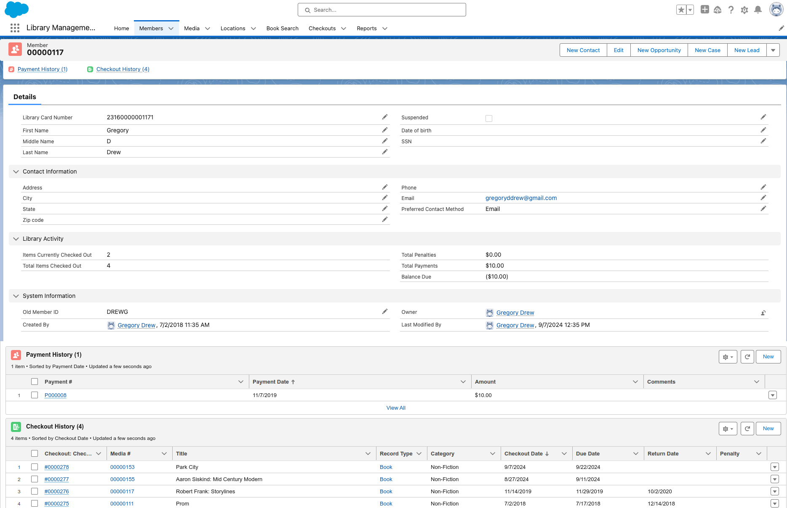
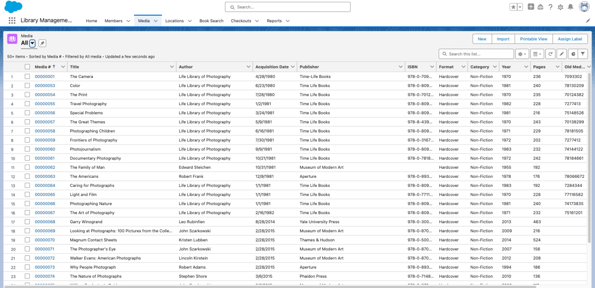
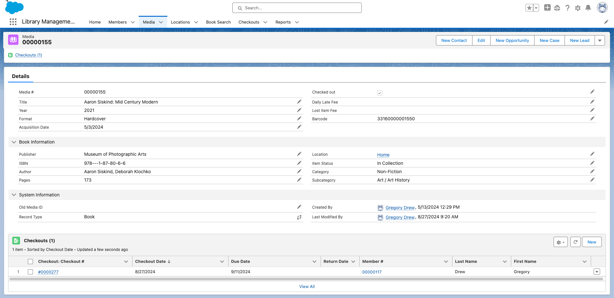
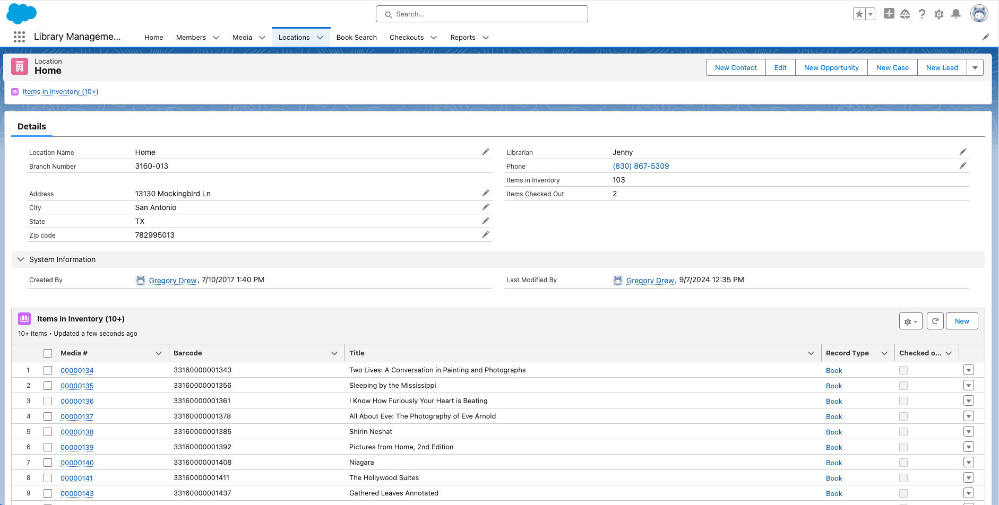
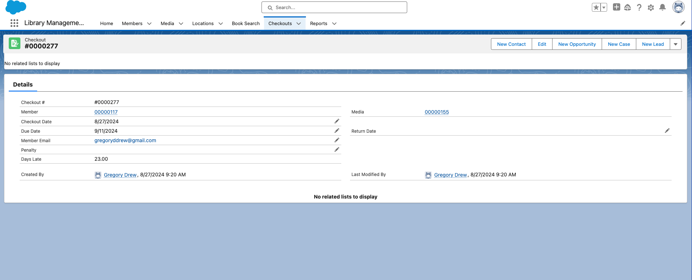

**About**

The LibrarySvc API is the backend for a web application which replaces a SalesForce application built in 2017. See the screenshots for the Salesforce app for examples.

This project uses Gmail to send actual messages. You can also use MailHog to mimic sending emails:
1. Download the image at https://github.com/mailhog/MailHog/releases.
2. Make the binary executable by issuing `chmod +x MailHog_linux_amd64` from a command line terminal in the directory where you downloaded it.
3. Then issue the command: `sudo mv MailHog_Linux_amd64 /usr/local/bin/mailhog` to move the binary to that location.
4. Run mailhog by issuing the command `mailhog`, then open a browser and go to http://localhost:8025.
Note: Mailhog does not require any authentication.

**Screen shots from Salesforce app**

*Patron Details*

*Media List*

*Media Details*

*Location Details*

*Checked Out Items Detail*
